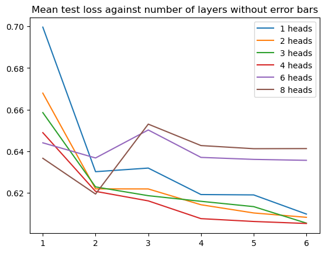

# Investigating context-dependent mutation of antibody via masked language model

> This project is done in collaboration with Dr Barbara Bravi and Kevin Michalewicz.

## Introduction

Epistasis is the phenomenon where the effects of mutations in a gene are dependent on the presence of mutations in other genes. In the context of antibody sequences, this means that the impact of a mutation in one part of an antibody might be influenced by mutations in other parts of the sequences. 

Specifically, mutations in heavy chains of antibodies are emphasized because specific regions on heavy chains are responsible for targeting antigens. Hence, their mutations play a prominent role in the binding specificity of antibodies. It is hence important to investigate the epistatisis of mutations on the heavy chains of antibody sequences, which can used to improve antibody designs in terms of binding affinity, statility and specificity.

<!-- impact of epistasis on antibody affinity -->

Recent studies on quantitative analysis of epistasis of protein sequences, in general, have shed light on studies of epistatic mutations of antibodies in specific. Methods such as direct coupling analysis (DCA) are effective in diagnosing the correlations between mutations at different sites. For example, using the concept of Shannon entropy to quantify the diversity of amino acids observed at a specific site, a DCA model defines context-dependent entropy(CDE) and context-independent entropy(CIE). By comparing both, we could interpret to what extent, the mutations at a specific site depend on the rest of the sequence. The closer the two quantities are, the less context-dependent the mutations at a specific site are. <!-- more formal -->
However, some limitations are involved in DCA. For example, when analysing context-dependence of mutations at a specific site, DCA assumes conditional independence of other sites while pairwise correlation might not be sufficient in predicting properties of mutations at a specific site given the rest of the sequence. Another limitation of DCA is that it provides a single matrix representing the conditional distribution of residues given sites on the rest of the sequence, which may lack interpretability concerning the structure of heavy chains through treating some neighbouring sites as a holistic region.

In consideration of these two limitations, the masked language model is introduced to study the mutation effects of antibodies. As a masked language model (MLM) makes predictions on the masked symbol given the rest of the sequence, we can make a direct comparison of the softmax output of MLM and the results of DCA on the conditional distribution of symbols at the same site. Meanwhile, using a transformer with multi-head attention, more insights can be obtained by extracting the attention weights of each head. This helps interpret the context dependence of mutations concerning the structures of heavy chains via attention across different regions of the sequences.

<!-- introduce transformers -->

Fortunately, a few transformers specialized in antibody sequences have been trained and the method of training can be utilised to develop interpretable models in our cases. Specifically, the architecture of antiBERTa is adapted to train an MLM. <!-- introduce bert -->

## Experimental procedures

A selection of 3146 heavy chain sequences was downloaded for the training of MLM from the SAbDab database[^sabdab]. The maximum length of each sequence is 128. Sequences were aligned by adding gaps in between. The entire dataset was split into disjoint training, evaluation, and test sets using an 8:1:1 ratio before training. 10 different partitions of the dataset were generated using 10 different random seeds.

<!-- include introduction of vocabulary-->

To conduct a hyperparameter search on the number of heads and the number of layers of the antiBERTa model, a hyperparameter space was constructed incrementally. A preliminary search was completed on the exhaustive combinations of 1-4 heads and 1-4 layers. For each combination of hyperparameters, 10 trainers were built with the above-mentioned datasets respectively. The initialisation of parameters was also randomised according to the same random seed used when generating the partition of the dataset. <!-- describe MLM prob etc --> The mean of the best evaluation loss throughout the training process was taken for each combination of hyperparameters
The hyperparameter space was extended according to the trend observed when comparing the average best evaluation loss of models. Evaluation and training of new models were then done recursively until an optimal was detected at the interior of the hyperparameter search.

A model with the lowest test loss was then selected from all 10 models with the optimal combination of hyperparameters. The output of the best model was interpreted from two perspectives:

1. Comparison with predictions given by restricted Boltzmann machine (RBM) <!-- introduction of RBM-->
2. Attention weights of each attention head

* The code of training the MLM was adapted from antiBERTa[^antiberta].
  <!-- hidden size and other setting -->

## Results

### Hyperparameter selection

As shown in the plot above, increase in number of hidden layers given the same number of heads improves the performance, in the preliminary hyperparameter search. Meanwhile, the difference in model performance due to different number of heads is diminishing with increasing number of layers. Seen from the heatmap below, the optimal combination of hyperparameters is at the boundary so the hyperparameter search is continued with a expanded hyperparameter space.

It is found that the model with 4 heads and 6 layers perform consistently better than other models both in terms of the mean test loss and evaluation loss. Meanwhile, the improvement by increasing from 5 layers to 6 layers is slim, both in terms of the average and standard deviation. Therefore, the search is ceased though the optimal is at the edge.

### Comparison with RBM

Both RBM and MLM make predictions on the masked tokens by giving a probability vector over all possible tokens.  The following points shows the predictions of both models on a arbitrary sequence from the dataset. It can be seen that they produce similar predictions especially on the positions where their positions are most deterministic.

### Attention weights

In general, self-attention weights of the sequences form sparse matrices, which means most of regions of sequences are barely attended. To gain meaningful insights linked with the structure of antibody, we visualise self-attentions from the second head and the last layer among the variable regions of the sequences, following the IMGT convention. 

The following plot represents the attention weights from an average antibody sequences, where the sites that are most attended to are the boundaries of complementary determination regions (CDRs).

The following plot shows not only "stripe" patterns along the boundaries of CDRs but also a block diagonal (though less prominent)  which represents self-attentions within each CDR. 

## Future work

Interpretation of transformer-based models on protein sequences in general could take place at different levels. For example, interpreting outputs using diagnostic classifiers, and interpreting embeddings or attentions in the context of protein structures. In the future, more systematic inspection of attention weights linked to contact maps could bring more insights into understanding the model. Meanwhile, paratope prediction could be a good diagnostics for the outputs.

Due to the constraint of time and resources, only a small set of data has been used for training. Therefore, the statistical distribution of attention weights from the model trained on this dataset may not be representative of studying the problem of antibodies in general. The model could generalise better if a bigger dataset is used.

## References

[^antiberta]: https://github.com/alchemab/antiberta
[^attention-interpret]: https://arxiv.org/pdf/2006.15222.pdf
[^sabdab]: https://opig.stats.ox.ac.uk/webapps/sabdab-sabpred/sabdab/search/
